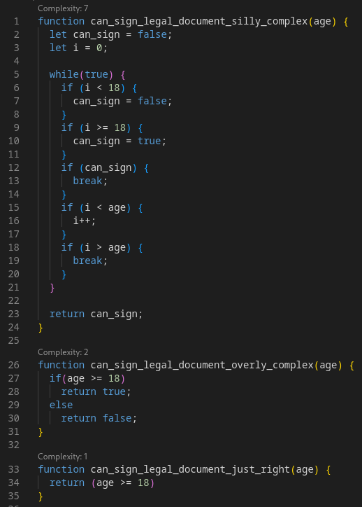

# Cyclotron

Cyclotron is a Visual Studio Code Extension to display cyclomatic complexity of function. It was written as an experiment to using Copilot to write a small program with a simple scope.

## What is cyclomatic complexity?

It is a software metric used to measure the complexity of a program.It quantifies the number of different paths a program can take during its execution. Higher complexity typically means the code is more difficult to understand. It can be a useful tool for identifying areas of code to refactor    

### Example

This is an example of a function that checks if you are of legal age to sign a contract. 




## The experiment

Goals of the experiment were to have Copilot do everything until I was not making progress anymore. My plan personal goals were:
* Don't read any documentation
* Don't debug any code 
* Definitely don't write my own tests

### Those goals are silly, why did you do that?

The goals are unrealistic, but over two decades working as a programmer I have seen many people try to power their way through problems by copy pasting from Stack Overflow or randomly changing code hoping for a different error. While this is not the average developer, I do feel there are people who work like this.

## Outcomes

I really should have been more scientific and kept better track of my copilot conversation, what I have here are some high level remarks from this experiment.

### Code generation for a clear task is relatively good

Asking Copilot chat to built a VSCode extension to calculate cyclomatic complexity and display it with the code got me started really fast. The challenge is that you have to be very specific about what you want to do.

Complexity is now displayed using a Code Lense Provider, but that is only after I failed doing is using decorations. While the code it generated worked flawlessly, what I did not know at the time (since I did not bother reading documentation) is that decorations stack.

The original plan was to highlight code in shade of red and the complexity went up, but since the decoration stack the highlighting could not decrease in intensity.

#### Surely Copilot could solve this?

Not, really. While Copilot did offer solutions all the solutions assumed that you would be able to find your decorations based on the position in a file. You could adapt this approach to delete all decorations and regenerate them, which would not be any worse than the current Code Lense implementation.

### Code completion is excellent

Copilot is really good at suggesting code blocks. Defining functions and interfaces were definitely much better than only using intellisense.

### Day dreaming is a problem

I specifically wanted support for at least two languages. I started with support for Javascript, when I started asking for Typescript support the libraries were all daydreamed. How did I know the library did not exist? `npm install` failed. When it failed I went looking for the library and realised it did not exist.

#### How did you beat the daydreaming?

I had to do research and read documentation, specifically on generating Abstract Syntax trees for Typescript. Once I understood how to do that I was able to use Copilot again to craft a specific prompt that included specific library names that I knew should work. This approach worked well, but milage will vary depending on the training data.

### Unit testing generation is decent

With an extremely simple prompt ("Write unit tests for this extension"), all the tests in this repo was generated. Except is does not run, it raises the error "ReferenceError: jest is not defined" and it does not test core functionality.

Unit testing is critically important for company code bases, and while I did not spend time here I do see massive value using Generative AI to write boiler plate tests and improve development time.

#### Fixing this

I didn't, I had my conclusions by this point and was not in the mood to fix unit tests.

## Conclusion

There is a school of developers who believe that we should code in a pure text editors as it forces us to build certain skills. While I do support this view to an extent Copilot, and Generative AI in general, are excellent companions. There are some edge cases where performance is less than desirable, but to an experienced programmer these should not be a problem.

The risk when using coding companions are people looking for quick solutions which can lead to an over reliance on generated code without understanding how it works. We have already seen this from developers who copy and paste code from Stack Overflow. Coupled with potential risks of data privacy and intellectual property infringement requires us to be cautious.

Ultimately the responsible use of these tools lies in the hands of developers. We should embrace the benefits offered while staying mindful of the limitations. It is up to us to ensure we develop our own skills so that our code remains efficient, secure, and maintainable.

## A little something extra

That ridiculous example with a complexity of 7, I asked ChatGPT what the code does. Not only did it explain the code pretty well, it also ended with:

**Issues with the Code:**
* The logic is unnecessarily complex for this task. A simpler approach would be:

```javascript
function can_sign_legal_document(age) {
  return age >= 18;
}
```

Which really demonstrates the strength of using Generative AI as a coding companion.
